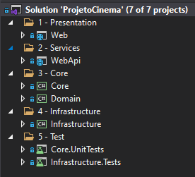
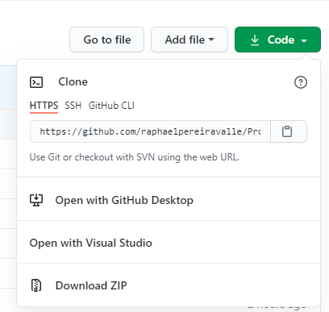
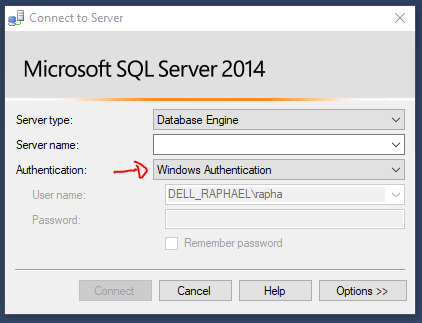
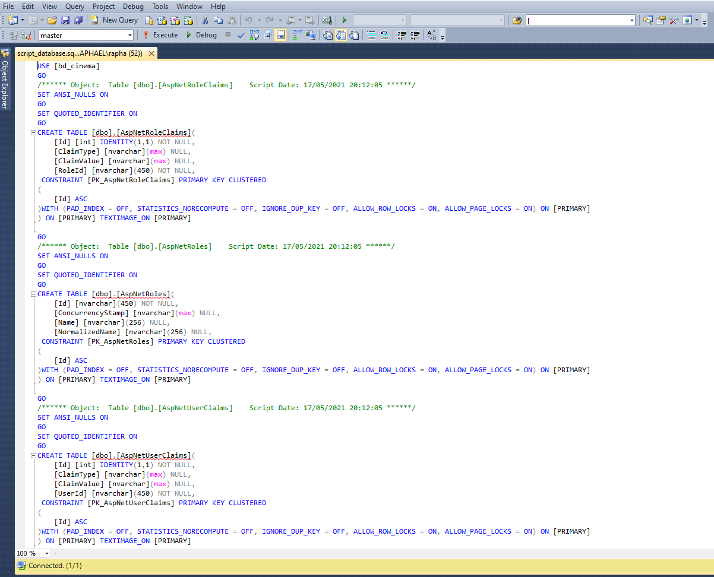
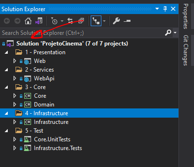
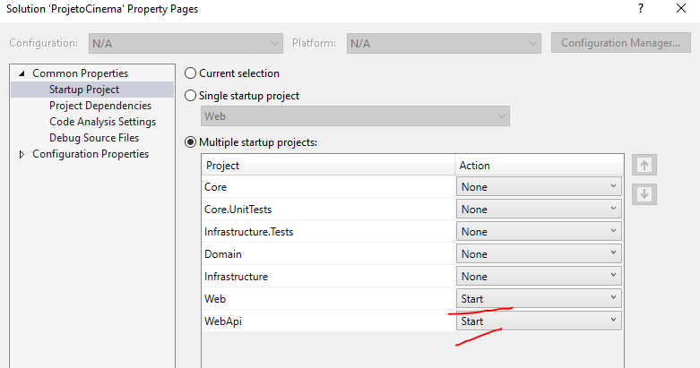
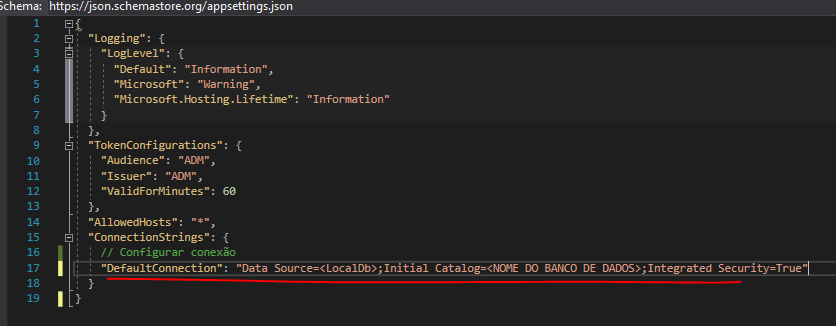
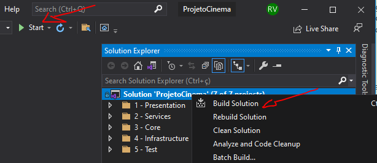

# Projeto Cine Pipoca
Sistema para gerencinar filmes, salas e sessões de um cinema.

## Patterns/Tecnologias:
* ASP.NET 5
* DDD
* Dapper (Mapeador e manipulação de objetos para acesso a dados)
* Princípios SOLID
* ASP.NET Identity
* Autenticação e autorização (JWT e Cookies)
* Layer API implementation
* Swagger (API Development)
* Sql Server 2014 Community ENG

## Front End:
* Bootstrop
* Ajax
* Jquery
* Bibliotecas para layout e validação de dados

## Telas
* Usuário: administrador@cine.com
* Senha: 123456

  

  

  

  

  

  

## MERScript do banco de dados

  

## Script banco de dados
<a href="https://github.com/raphaelpereiravalle/ProjetoCinema/tree/master/BancoDeDados">Arquivo</a>

## Estrutura

  

* 1 - Presentation
	* Camada de apresentação com CRUD;
	* Plugins CSS e JavaScript;
	* MVC;
	* Classe de comunicação do API. 
* 2 - Services
	* API;
	* Segurança com o JWT.
* 3 - Core
	* Entidades de domínio, interfaces e segurança;
	* Serviços e intefaces.
* 4 - Infrastructure
	* Repository Pattern: Repositórios EF Core e Dapper para a persistência de dados do banco de dados;
	* Entity Framework Context.
* 5 - Test
	* Testes
	
## Ambiente para testar o projeto

* Efetue o clone clicando no botão Code e selecione uma das opções: 
	* Linha de comando do git
		* git clone https://github.com/raphaelpereiravalle/ProjetoCinema.git
	* Clone o repositório diretamento para o Visual Studio ou Visual Code;
	* Download;
	

  

* Conecte o Sql Server para restaurar o banco de dados, use a opção de Windows Authentication para autenticação do banco dados e inclua o Server Name. Após conectar selecione, o 
<a href="https://github.com/raphaelpereiravalle/ProjetoCinema/tree/master/BancoDeDados">arquivo</a> e execute-o na New query. 

  

  

* É importante configurar o *Startup Project* do projeto. Para isso, clique com o botão direto em Solution, clique em Properties e selecione a opção Start na coluna Action (Lembrando que essa opção pode ser customizada).
 

  

  

* Acesse o arquivo appsettings na camadas 2 - Services -> WebApi e configure a conexão com o banco de dados.

  

* Execute o Build Solution. Depois clique em Start para executar o projeto.

  

## Author

The ProjetoCinema was developed by Raphael Pereira Valle.