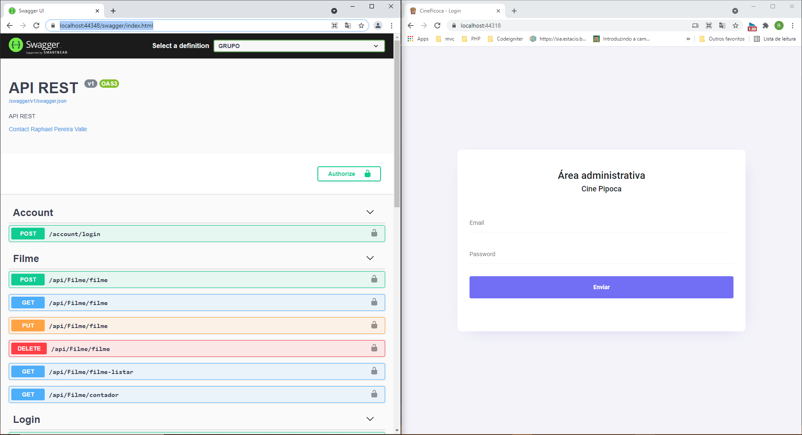
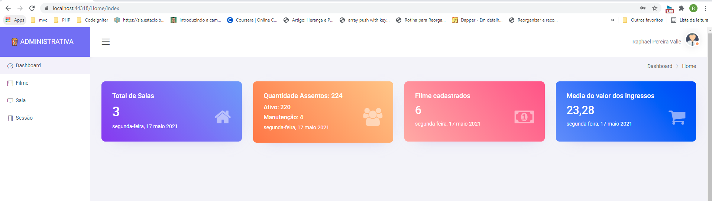
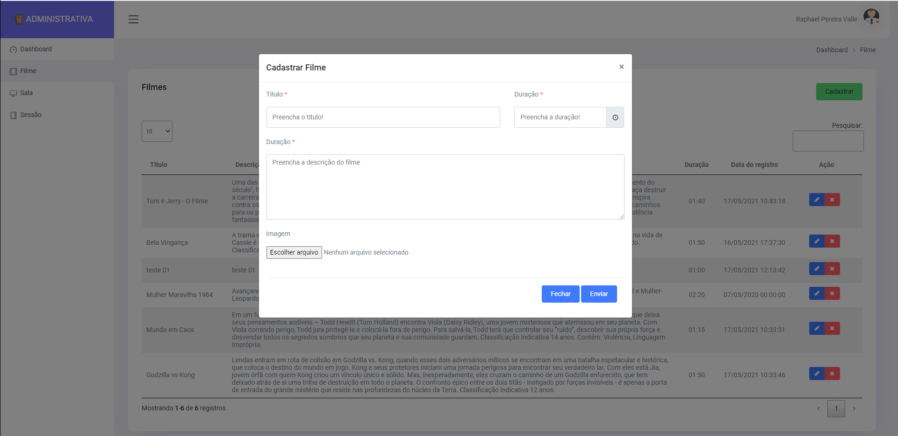
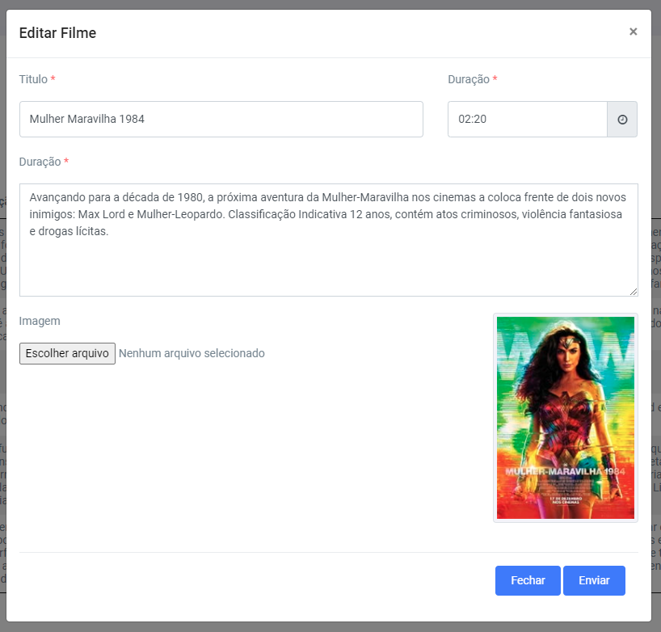
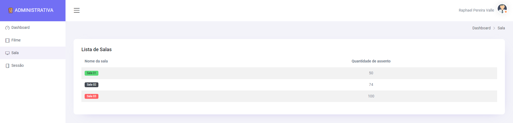
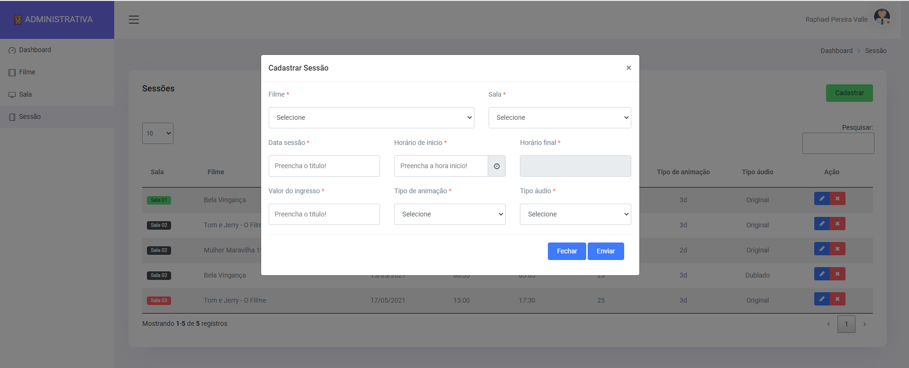
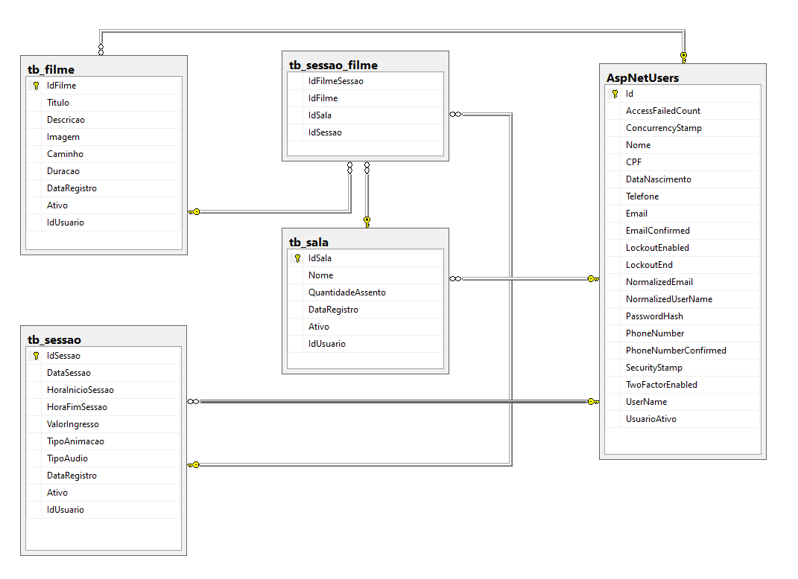

# Projeto Cine Pipona  
Sistema para gerencinar filmes, salas e sessões de um cinema.

## Patterns/Tecnologias:
* ASP.NET 5
* DDD
* Dapper (Mapeador e manipulação de objetos para acesso a dados)
* Princípios SOLID
* ASP.NET Identity
* Autenticação e autorização (JWT e Cookies)
* Layer API implementation
* Swagger (API Development)
* Sql Server 2019

## Front End
* Bootstrop
* Ajax
* Jquery
* Bibliotecas para layout e valização de dados.

## Telas
Usuário: administrador@cine.com
Senha: 123456

  

  

  

  

  

  

## MERScript do banco de dados

  

<a href="https://github.com/raphaelpereiravalle/ProjetoCinema/tree/master/BancoDeDados">[Script banco de dados]</a>

## Author

The ApiNetCoreMongoDB was developed by [Raphael Pereira Valle].